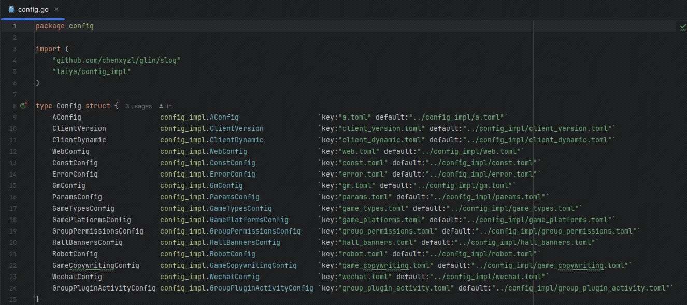
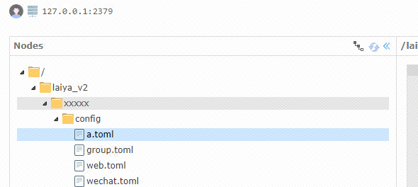

# glin
· 基于actor模型的分布式服务器框架(附带某app的demo)   
· 支持配置动态修改   
· 支持动态扩缩容   
· 组件模型   

## 目录结构
1. app:业务逻辑节点
2. 其他:是框架

## 环境配置
1. 下载etcd并以默认的端口号运行

## 远程动态加载(有需要覆盖本地配置时添加)
1. 配置目录
   
2. etcd配置参考(注意启动的"xxxxx"为make时候当前的分支名字,需要替换为如"main")   
  

## 编译流程(注:windows可以用wsl来编译)
1. cd app && make all

## 运行流程(注:windows可以用wsl来运行)
1. cd app/bin && ./run.sh restart

## 业务节点简介
### 目录结构
1. app/register: actor rpc注册
2. app/bin: 编译后可执行文件的生成目录
3. app/cmd: 可执行节点的代码文件入口
4. app/model: 数据存储协议model
5. app/config: 配置代码相关(包含配置模板文件)
6. app/gate: gate节点的实际业务逻辑
7. app/home: home节点的实际业务逻辑
8. app/group: group节点实际的业务逻辑
9. app/web: web节点实际的业务逻辑
10. app/wechat: wechat节点实际的业务逻辑
11. app/proto: proto协议生成目录
12. app/proto_file: proto协议定义目录(outer:对外接口协议)
13. app/share: 公共代码

### 协议执行流程(即客户端登录流程)
1. 获取验证码(web节点),[例:127.0.0.1:11202/web/getCaptcha]
2. 校验验证码(web节点),[例:127.0.0.1:11202/web/checkToken]
3. websocket链接(gate)[例:ws://127.0.0.1:11301/room?token=xxx]
4. 到这里可以发送业务逻辑代码了,如获取用户信息等等(同时支持http和websocket)[例:127.0.0.1:11202/api/v1/getUserInfo]

### 客户端链接demo
1. 待补充